# PhosLab Explained

This file is a short, separate explanation of how the project works. It is meant to be easier to scan than the main README.

## Big Picture

PhosLab is a pipeline for visual cortical prosthesis experiments. It starts with an implant design, predicts where each electrode should create a phosphene, runs a perceptual experiment, analyzes the user's drawing, and learns a correction for the phosphene map.

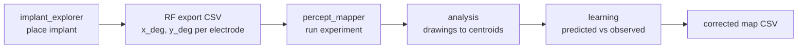

## Main Parts

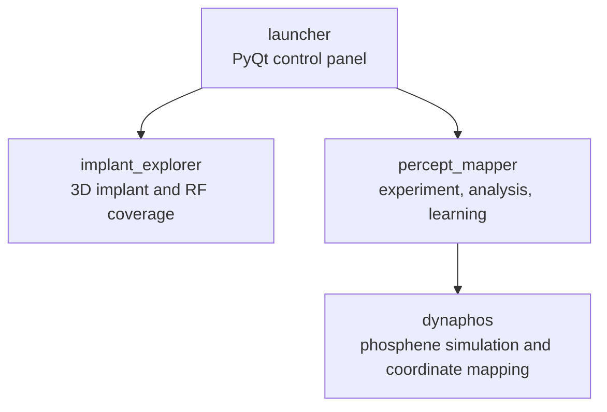

### `launcher/`

The launcher is the graphical control panel. It starts the other tools, watches for new CSV files from `implant_explorer`, copies them into `percept_mapper/config/`, updates `params.yaml`, and runs learning or corrected-map generation.

### `implant_explorer/`

This is the 3D implant placement tool. It loads brain/retinotopy data, lets the user place one or more implant designs, shows receptive-field coverage, and exports a CSV with visual-field coordinates for contacts.

Important output:

```text
implant_explorer/*.csv
```

The useful columns are usually:

```text
implant_id, electrode_index, x_deg, y_deg, polar_deg, ecc_deg
```

### `percept_mapper/`

This is the experiment engine. It reads `config/params.yaml`, loads electrode positions from a PhosLab CSV or YAML coordinates, shows phosphene stimuli with Pygame, records user drawings, analyzes drawings, and trains correction models.

It supports three input modes:

```text
mouse = mouse position is used as gaze/fixation input
gaze  = local webcam eye tracker is used
pupil = Pupil Labs / Pupil Capture gaze is read over ZMQ
```

### `dynaphos/`

This is the phosphene simulation library used by `percept_mapper`. In this repo it is wrapped by `percept_mapper/scripts/dynaphos_adapter.py`.

The adapter can load either:

```text
PhosLab CSV coordinates in visual degrees
YAML cortical coordinates in millimeters
```

It converts visual degrees to screen pixels so the stimulus appears in the right place.

## Input Sources

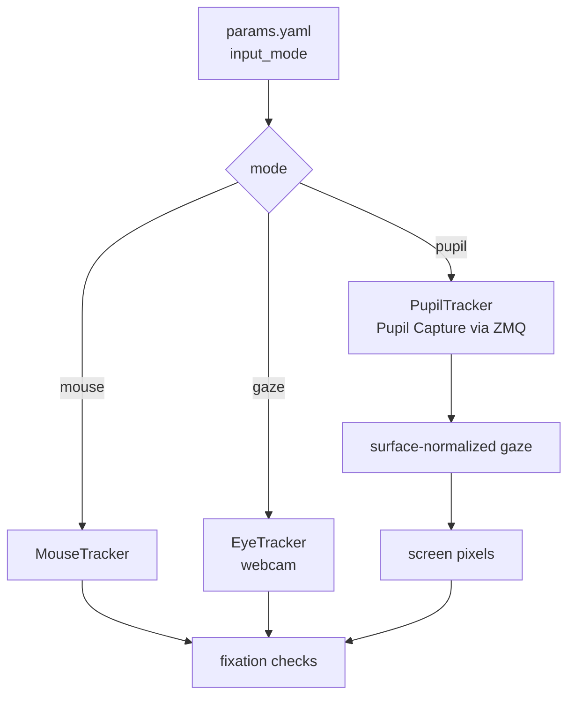

For Pupil Labs mode, Pupil Capture must already be running with Surface Tracker enabled. PhosLab subscribes to a named surface topic, reads normalized gaze, converts it to screen pixels, and uses the same fixation interface as the webcam and mouse trackers.

Relevant config:

```yaml
input_mode: pupil

pupil:
  address: 127.0.0.1
  port: 50020
  surface_name: phoslab_screen
  min_confidence: 0.6
```

## Launcher Flow

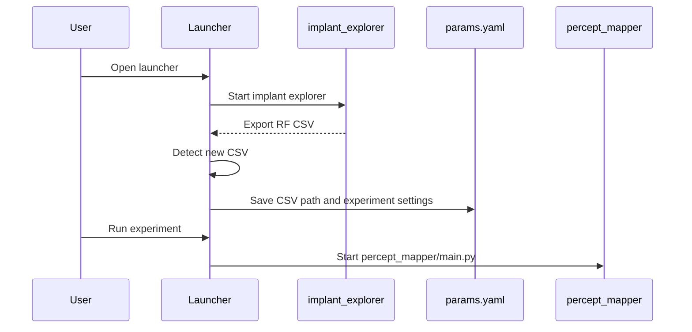

## Experiment Modes

PhosLab has two experiment modes.

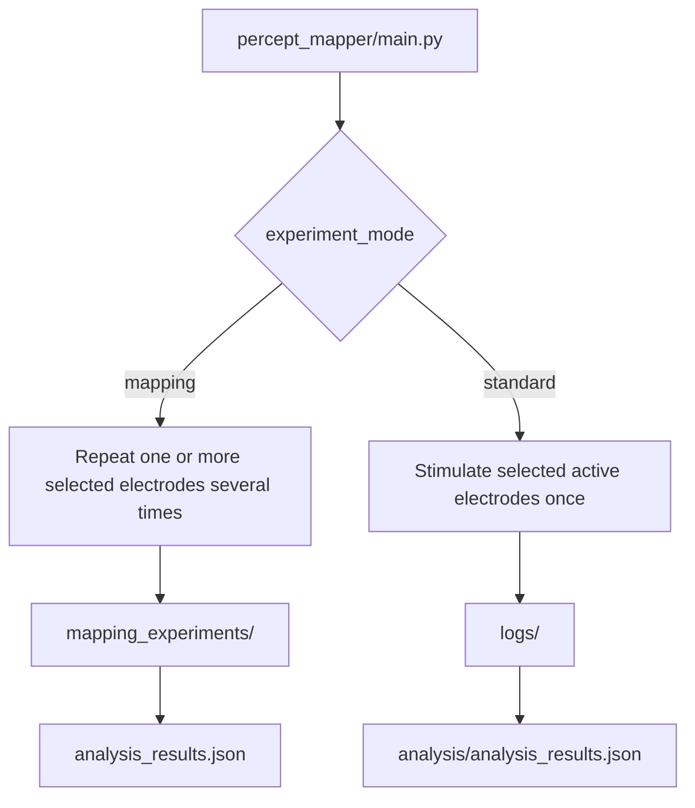

### Mapping mode

Mapping mode is used to estimate the perceived location of selected electrodes more carefully. Each electrode is stimulated multiple times. The user draws the phosphene after every repetition.

Output shape:

```text
percept_mapper/mapping_experiments/
  mapping_.../
    electrode_080/
      repetition_001.png
      repetition_002.png
      metadata.json
      analysis_results.json
      analysis_repetitions.csv
```

### Standard mode

Standard mode stimulates the selected active electrodes in sequence. Each phosphene gets one drawing. After the experiment, the standard analyzer converts the data into the same style of `analysis_results.json` used by mapping mode.

Output shape:

```text
percept_mapper/logs/
  experiment_.../
    drawing_001.png
    metadata.json
    analysis/
      electrode_080/
        analysis_results.json
        analysis_repetitions.csv
```

## Single Trial Loop

Each trial follows the same basic state machine.

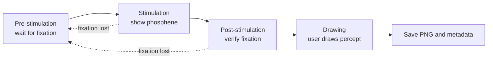

The drawing is important because analysis uses the drawn pixels to calculate the perceived phosphene center.

## Coordinate Flow

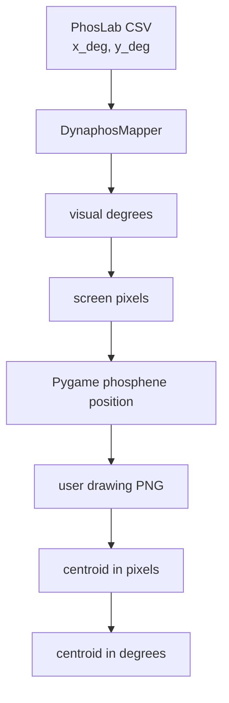

The project keeps a clear distinction:

```text
x_deg, y_deg       = visual-field coordinates
x_px, y_px         = screen coordinates
obs_x_deg, obs_y_deg = user-observed centroid converted back to degrees
```

## Analysis

The analyzers read drawings and calculate centroids.

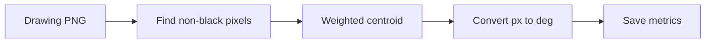

Main outputs:

```text
analysis_results.json
analysis_repetitions.csv
analysis_plot.png
analysis_boxplots.png
```

The key learning values are:

```text
pred_x_deg, pred_y_deg = predicted phosphene position
obs_x_deg, obs_y_deg   = observed user-drawn position
error_x_deg            = obs_x_deg - pred_x_deg
error_y_deg            = obs_y_deg - pred_y_deg
```

## Learning and Correction

Learning reads both mapping and standard experiments, builds one dataset, trains correction models, evaluates them, and saves model files and plots.

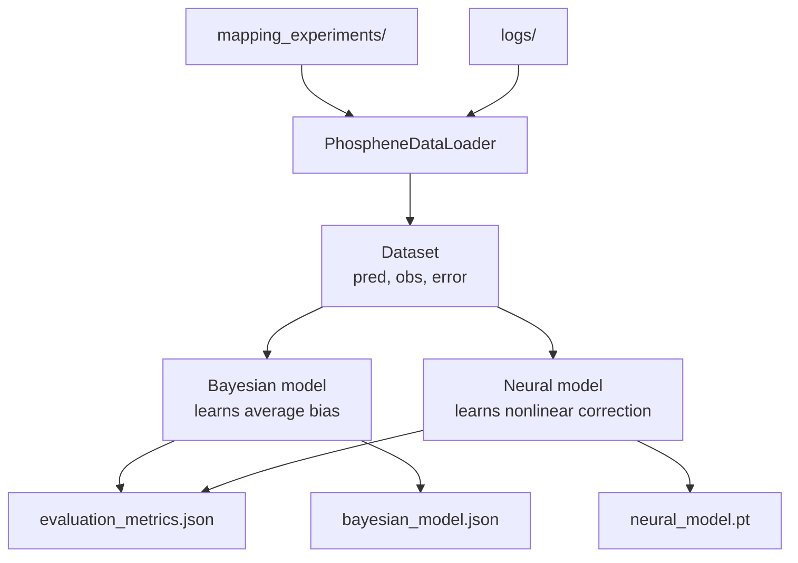

The Bayesian model learns a global X/Y bias:

```text
corrected_x = predicted_x + learned_bias_x
corrected_y = predicted_y + learned_bias_y
```

The neural model, when PyTorch is available, learns a nonlinear mapping from predicted position to observed position.

## Corrected Map

After learning, `generate_corrected_map.py` applies the trained model to the original PhosLab CSV.

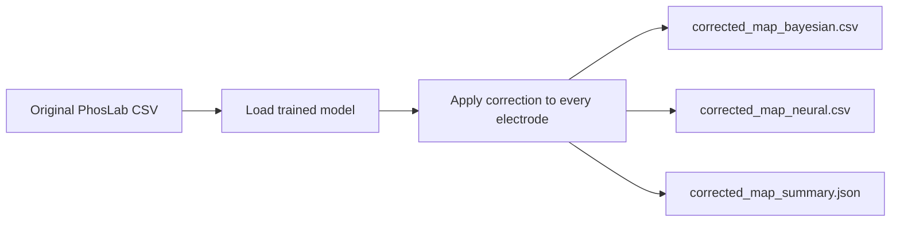

These outputs are written to:

```text
percept_mapper/learning_results/
```

## Most Important Files

```text
launcher/main.py                         starts the GUI launcher
launcher/launcher.py                     orchestrates the pipeline
implant_explorer/src/implant_explorer.py 3D implant/RF explorer
percept_mapper/main.py                   experiment runner
percept_mapper/config/params.yaml        central experiment settings
percept_mapper/scripts/dynaphos_adapter.py loads and converts electrode coordinates
percept_mapper/core/pupil_tracker.py       reads Pupil Labs gaze via ZMQ
percept_mapper/scripts/phosphene_mapping.py mapping-mode repetition logic
percept_mapper/scripts/mapping_analyzer.py drawing analysis for mapping mode
percept_mapper/scripts/standard_analyzer.py drawing analysis for standard mode
percept_mapper/run_learning.py           trains correction models
percept_mapper/generate_corrected_map.py applies correction models to a CSV
```

## Minimal Mental Model

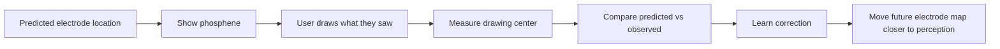

In one sentence: PhosLab predicts where stimulation should appear, measures where the user says it appeared, and uses that difference to improve the map.

## ASCII Diagrams

These are plain-text versions of the diagrams above.

### Whole Pipeline

```text
+------------------+     +------------------+     +------------------+
| implant_explorer | --> | RF export CSV    | --> | percept_mapper   |
| place implant    |     | x_deg, y_deg     |     | run experiment   |
+------------------+     +------------------+     +------------------+
                                                        |
                                                        v
                          +------------------+     +------------------+
                          | learning         | <-- | analysis         |
                          | pred vs observed |     | drawings->center |
                          +------------------+     +------------------+
                                  |
                                  v
                          +------------------+
                          | corrected map    |
                          | CSV              |
                          +------------------+
```

### Project Parts

```text
                         +-----------------------------+
                         | launcher                    |
                         | PyQt control panel          |
                         +-------------+---------------+
                                       |
                    +------------------+------------------+
                    |                                     |
                    v                                     v
        +-----------------------------+       +-----------------------------+
        | implant_explorer            |       | percept_mapper              |
        | 3D implant + RF coverage    |       | experiment + learning       |
        +-----------------------------+       +--------------+--------------+
                                                             |
                                                             v
                                               +-----------------------------+
                                               | dynaphos                    |
                                               | phosphene simulation        |
                                               +-----------------------------+
```

### Launcher Flow

```text
User
  |
  v
+------------------+       starts        +------------------+
| launcher         | ------------------> | implant_explorer |
+------------------+                     +------------------+
  |                                             |
  | watches for CSV                             | exports CSV
  |                                             v
  |                                      +------------------+
  +------------------------------------> | RF CSV detected  |
                                         +------------------+
                                                   |
                                                   v
                                         +------------------+
                                         | params.yaml      |
                                         | CSV + settings   |
                                         +------------------+
                                                   |
                                                   v
                                         +------------------+
                                         | percept_mapper   |
                                         | experiment run   |
                                         +------------------+
```

### Input Sources

```text
                         +----------------------+
                         | params.yaml          |
                         | input_mode           |
                         +----------+-----------+
                                    |
                                    v
                         +----------------------+
                         | mode                 |
                         +----+------------+----+
                              |            |
              mouse           | gaze       | pupil
              v               v            v
     +----------------+ +-------------+ +----------------------+
     | MouseTracker   | | EyeTracker  | | PupilTracker         |
     | cursor input   | | webcam      | | Pupil Capture + ZMQ  |
     +-------+--------+ +------+------+ +----------+-----------+
             |                 |                   |
             +-----------------+-------------------+
                               |
                               v
                    +----------------------+
                    | fixation checks      |
                    | prestim/stim/post    |
                    +----------------------+
```

### Experiment Modes

```text
                         +------------------------+
                         | percept_mapper/main.py |
                         +-----------+------------+
                                     |
                                     v
                         +------------------------+
                         | experiment_mode        |
                         +-----+-------------+----+
                               |             |
                 mapping       |             | standard
                               v             v
        +--------------------------+   +--------------------------+
        | repeat selected          |   | stimulate active         |
        | electrodes several times |   | electrodes once          |
        +------------+-------------+   +-------------+------------+
                     |                               |
                     v                               v
        +--------------------------+   +--------------------------+
        | mapping_experiments/     |   | logs/                    |
        | electrode_*/results      |   | analysis/electrode_*     |
        +--------------------------+   +--------------------------+
```

### Single Trial

```text
+------------------+     +------------------+     +------------------+
| pre-stimulation  | --> | stimulation      | --> | post-stimulation |
| wait fixation    |     | show phosphene   |     | verify fixation  |
+------------------+     +---------+--------+     +---------+--------+
        ^                          |                    |
        | fixation lost            | fixation lost      |
        +--------------------------+--------------------+
                                                        |
                                                        v
                                             +------------------+
                                             | drawing          |
                                             | user draws       |
                                             +--------+---------+
                                                      |
                                                      v
                                             +------------------+
                                             | save PNG + JSON  |
                                             +------------------+
```

### Coordinate Flow

```text
+------------------+
| PhosLab CSV      |
| x_deg, y_deg     |
+--------+---------+
         |
         v
+------------------+     +------------------+     +------------------+
| DynaphosMapper   | --> | visual degrees   | --> | screen pixels    |
+------------------+     +------------------+     +------------------+
                                                        |
                                                        v
                          +------------------+     +------------------+
                          | user drawing PNG | <-- | Pygame position |
                          +--------+---------+     +------------------+
                                   |
                                   v
                          +------------------+
                          | centroid px      |
                          +--------+---------+
                                   |
                                   v
                          +------------------+
                          | centroid degrees |
                          +------------------+
```

### Analysis

```text
+-------------+     +------------------+     +------------------+
| drawing PNG | --> | non-black pixels | --> | weighted center  |
+-------------+     +------------------+     +------------------+
                                                   |
                                                   v
                                         +------------------+
                                         | px to degrees    |
                                         +--------+---------+
                                                  |
                                                  v
                                         +------------------+
                                         | metrics + plots  |
                                         +------------------+
```

### Learning

```text
        +----------------------+       +----------------------+
        | mapping_experiments/ |       | logs/                |
        +----------+-----------+       +----------+-----------+
                   |                              |
                   +--------------+---------------+
                                  |
                                  v
                       +----------------------+
                       | PhospheneDataLoader  |
                       +----------+-----------+
                                  |
                                  v
                       +----------------------+
                       | dataset              |
                       | pred, obs, error     |
                       +-----+-----------+----+
                             |           |
                             v           v
             +---------------------+   +---------------------+
             | Bayesian model      |   | Neural model        |
             | learns bias         |   | nonlinear mapping   |
             +----------+----------+   +----------+----------+
                        |                         |
                        +------------+------------+
                                     |
                                     v
                         +----------------------+
                         | metrics, plots,      |
                         | saved model files    |
                         +----------------------+
```

### Corrected Map

```text
+----------------------+     +----------------------+     +----------------------+
| original PhosLab CSV | --> | trained model        | --> | corrected CSVs       |
| x_deg, y_deg         |     | Bayesian or neural   |     | bayesian / neural    |
+----------------------+     +----------------------+     +----------------------+
                                                                  |
                                                                  v
                                                        +----------------------+
                                                        | corrected summary    |
                                                        | JSON                 |
                                                        +----------------------+
```
